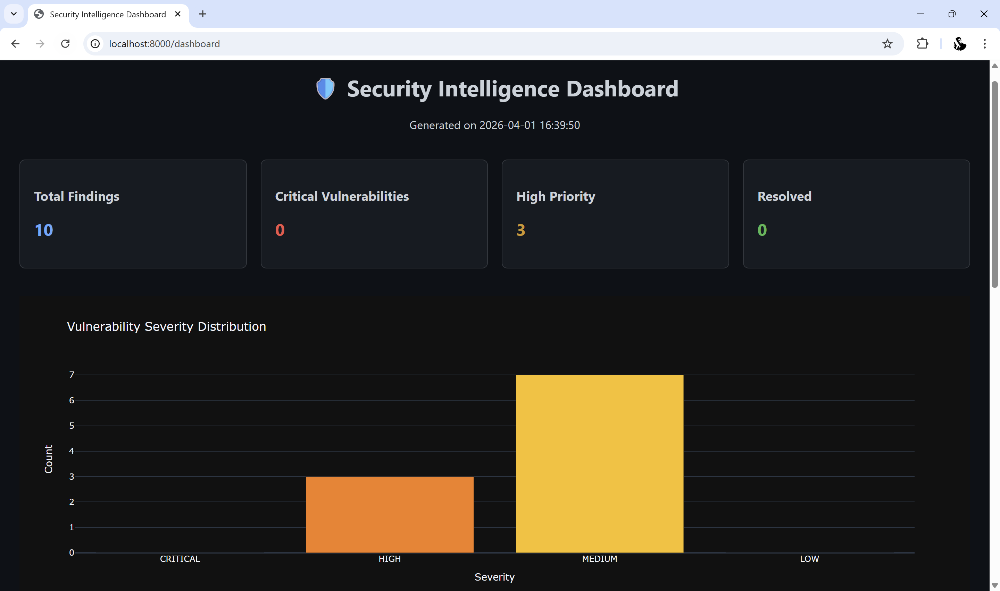
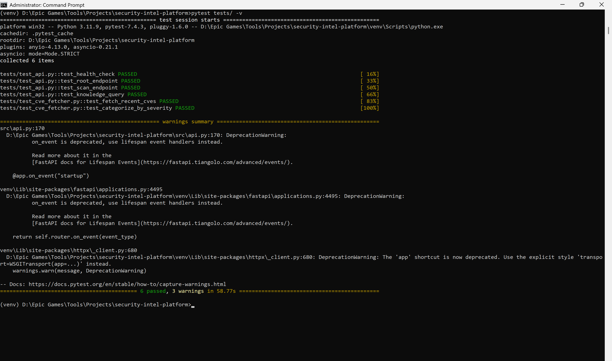
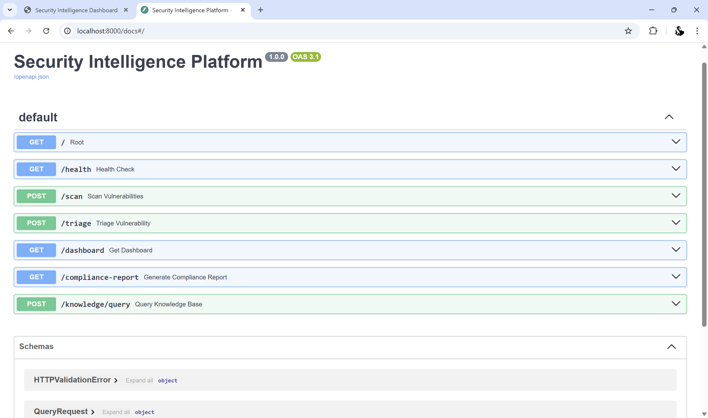

# Security Intelligence Platform 🛡️

An AI-powered security automation platform that combines vulnerability management, AI-driven triage, and compliance reporting — designed for enterprise security teams.

## 🎯 Core Features

### 1. Automated Vulnerability Scanning
- Fetches real-time CVE data from NIST NVD API
- Categorizes vulnerabilities by severity (CRITICAL/HIGH/MEDIUM/LOW)
- Tracks CVSS scores and publication timelines

### 2. AI-Powered Triage Agent
- Uses local LLM (Mistral via Ollama) for intelligent vulnerability analysis
- Assesses exploitability and business impact
- Provides actionable remediation steps
- Maps findings to OWASP Top 10 categories

### 3. Security Knowledge Base
- Vector database (ChromaDB) for security policies and findings
- Semantic search for policy questions
- Pre-seeded with OWASP Top 10 best practices

### 4. Interactive Dashboards
- Real-time severity distribution charts
- CVSS score timelines
- Compliance KPI gauges (ISO 27001, SOC2)

### 5. Compliance Reporting
- Automated evidence collection
- AI-generated audit-ready reports
- Configurable compliance thresholds


## 📸 Screenshots

### Security Dashboard

*Real-time vulnerability severity distribution and CVSS timeline*

### AI Triage Analysis

*AI-powered vulnerability assessment with remediation steps*

### Compliance Reporting

*Automated ISO 27001 / SOC2 audit-ready reports*


## 🚀 Tech Stack

- **Python 3.11** - Core language
- **FastAPI** - REST API framework
- **LangChain** - AI orchestration
- **Ollama + Mistral** - Local LLM (zero API costs)
- **ChromaDB** - Vector database
- **Plotly** - Interactive visualizations
- **Docker** - Containerization
- **pytest** - Testing framework

## 📦 Installation

### Prerequisites
- Python 3.11+
- Ollama installed and running
- Docker Desktop (optional)

### Setup Steps

**1. Clone the repository**
```bash
git clone https://github.com/1601chirag/security-intel-platform.git
cd security-intel-platform
```

**2. Create virtual environment**
```bash
py -3.11 -m venv venv
venv\Scripts\activate
```

**3. Install dependencies**
```bash
pip install -r requirements.txt
```

**4. Start Ollama (separate terminal)**
```bash
ollama serve
ollama pull mistral
```

**5. Run the application**
```bash
uvicorn src.api:app --reload
```

**6. Access the platform**
- API: http://localhost:8000
- Interactive Docs: http://localhost:8000/docs

## 🔬 Usage Examples

### Scan Recent Vulnerabilities
```bash
curl -X POST "http://localhost:8000/scan" \
  -H "Content-Type: application/json" \
  -d '{"days": 7, "results_per_page": 20}'
```

### AI Triage Analysis
```bash
curl -X POST "http://localhost:8000/triage" \
  -H "Content-Type: application/json" \
  -d '{"cve_id": "CVE-2024-12345"}'
```

### View Dashboard
Navigate to: http://localhost:8000/dashboard

### Generate Compliance Report
```bash
curl -X GET "http://localhost:8000/compliance-report"
```

### Query Knowledge Base
```bash
curl -X POST "http://localhost:8000/knowledge/query" \
  -H "Content-Type: application/json" \
  -d '{"query": "How to prevent SQL injection?", "n_results": 3}'
```

## 🧪 Testing

**Run all tests:**
```bash
pytest tests/ -v
```

**Run specific test file:**
```bash
pytest tests/test_api.py -v
```

## 🐳 Docker Deployment

**Build and run with Docker:**
```bash
docker-compose up --build
```

## 📊 Project Structure
```
security-intel-platform/
├── src/
│   ├── config.py              # Configuration
│   ├── cve_fetcher.py         # CVE data retrieval
│   ├── ai_agent.py            # AI triage logic
│   ├── knowledge_base.py      # Vector DB operations
│   ├── dashboard_generator.py # Visualization
│   └── api.py                 # FastAPI app
├── tests/
│   ├── test_api.py
│   └── test_cve_fetcher.py
├── data/                      # ChromaDB storage
├── reports/                   # Generated reports
├── requirements.txt
├── Dockerfile
├── docker-compose.yml
└── README.md
```

## 🛠️ Configuration

Edit `.env` file:
```env
OLLAMA_BASE_URL=http://localhost:11434
MODEL_NAME=mistral
CHROMA_PERSIST_DIR=./data/chroma_db
CVE_API_URL=https://services.nvd.nist.gov/rest/json/cves/2.0
```

## 🔐 Security Considerations

- CVE data is fetched from official NIST NVD API
- No external API keys required (fully local LLM)
- Sensitive data stored in local ChromaDB
- Rate limiting on NVD API (respect usage policies)


## 👨‍💻 Author

**Chirag Poojari**
- GitHub: [@1601chirag](https://github.com/1601chirag)
- LinkedIn: [chiragpoojari16](https://linkedin.com/in/chiragpoojari16)
